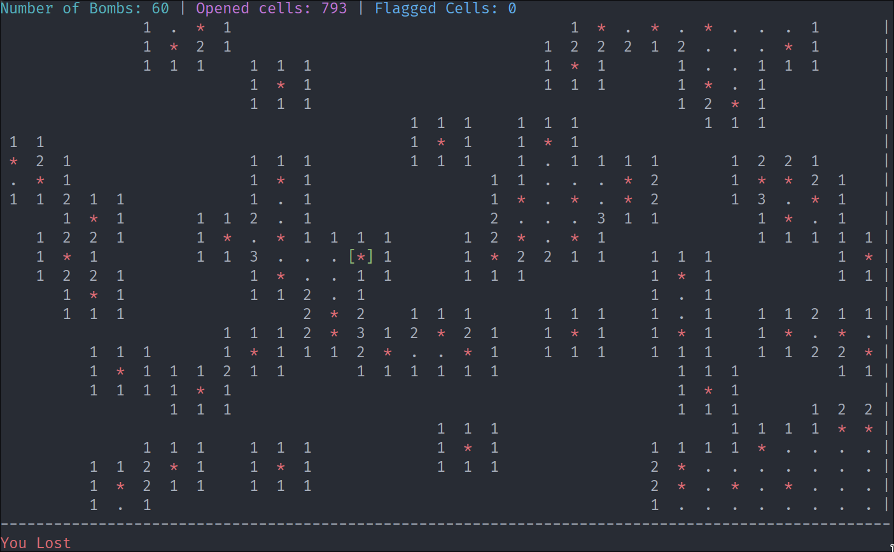

# Minesweeper Game



This is a command-line based implementation of the popular Minesweeper game in
various Programming Languages.

## Installation

Clone the repository:

```sh
git clone https://github.com/ShellTux/minesweeper.git
```

Navigate to the directory:

```sh
cd minesweeper
```

Navigate to a specific `language`:

```sh
cd c
```

Compile the program: `make`

```sh
make
```

## Game Rules

- The objective of the game is to uncover all the cells on the board that do not contain a mine.
- The player can `uncover` a cell by pressing `space`
- If a mine is `uncovered`, the `game is over`.
- If a cell does `not contain a mine`,
it will display a number indicating the number of neighboring cells that contain mines.
- The player can flag a cell by pressing `f`
- This is useful for marking cells that the player suspects contain mines.
- The game is won when all non-mine cells are uncovered.

<!-- ## Customization -->

<!-- The game can be customized by modifying the constants defined in game.h: -->

<!--     BOARD_SIZE: the size of the board (number of rows and columns) -->
<!--     NUM_MINES: the number of mines on the board -->

## Implementation

### Languages

- [x] C
- [ ] C++
- [ ] Pascal
- [x] Python
- [ ] Rust
- [ ] Haskell ?

### C

To run the program:

```sh
./minesweeper-c
```

or specify number of rows, columns or bombs:

```sh
./minesweeper-c --rows 10 --cols 10 --bombs 10
```

- [x] Movement (w,  a,    s,    d)
- [ ] Movement (up, left, down, right arrows)
- [x] Press `space` to open a cell
- [x] Press `f` to flag a cell
- [ ] Print Size of Table
- [x] Print Table after an operation
- [x] Print Number of bombs planted
- [x] Print amount of opened cells
- [x] Print amount of flagged cells
- [x] Add Color support
- [x] The `first cell` to be opened is __not__ a bomb
- [x] When the `revealed` cell is a `bomb`, then `game over`.
- [x] Open recursively empty neighboring cells
- [x] When a cell is opened, it's not possible to flag
- [x] When a cell is flagged and opened, reset the flag state
- [x] Win when exactly `all bombs have been flagged` and
`all non-bombs have been opened`.
- [x] Command line arguments input.
  - [x] Help page
  - [x] Number of Rows
  - [x] Number of Columns
  - [x] Number of Bombs

### C++

To build and run the program:

```sh
make
```

To run the program:

```sh
./minesweepper
```

or specify number of rows, columns or bombs:

```sh
./minesweepper --rows 10 --cols 10 --bombs 10
```

- [x] Movement (w,  a,    s,    d)
- [x] Movement (up, left, down, right arrows)
- [x] Press `space` to open a cell
- [x] Press `f` to flag a cell
- [x] Print Table after an operation
- [x] Print Size of Table
- [x] Print Number of bombs planted
- [x] Print amount of opened cells
- [x] Print amount of flagged cells
- [x] Add Color support
- [x] The `first cell` to be opened is __not__ a bomb
- [x] When the `revealed` cell is a `bomb`, then `game over`.
- [x] Open recursively empty neighboring cells
- [x] When a cell is opened, it's not possible to flag
- [x] When a cell is flagged and opened, reset the flag state
- [x] Win when exactly `all bombs have been flagged` and
`al  non-bombs have been opened`.
- [x] Command line arguments input.
  - [x] Help page
  - [x] Number of Rows
  - [x] Number of Columns
  - [x] Number of Bombs

### Python

- [x] Movement (w,  a,    s,    d)
- [ ] Movement (up, left, down, right arrows)
- [x] Press `space` to open a cell
- [x] Press `f` to flag a cell
- [ ] Print Size of Table
- [x] Print Table after an operation
- [x] Print Number of bombs planted
- [x] Print amount of opened cells
- [x] Print amount of flagged cells
- [x] Add Color support
- [x] The `first cell` to be opened is __not__ a bomb
- [x] When the `revealed` cell is a `bomb`, then `game over`.
- [x] Open recursively empty neighboring cells
- [x] When a cell is opened, it's not possible to flag
- [x] When a cell is flagged and opened, reset the flag state
- [x] Win when exactly `all bombs have been flagged` and
`all non-bombs have been opened`.
- [x] Command line arguments input.
  - [x] Help page
  - [x] Number of Rows
  - [x] Number of Columns
  - [x] Number of Bombs

## Acknowledgements

This game was inspired by the classic Minesweeper game by Microsoft.
License

This project is licensed under the MIT License. See the LICENSE file for details.
